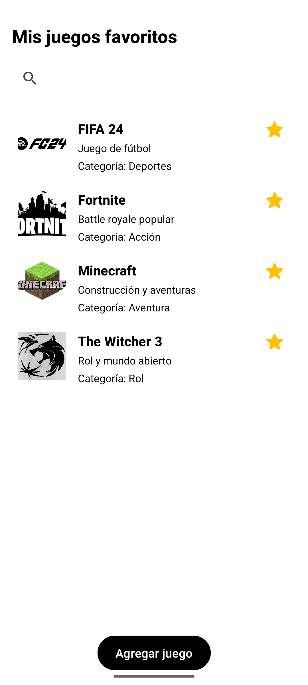
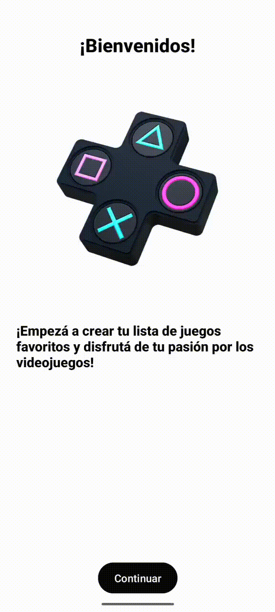

# Juegos Favoritos App

  - Nombre del proyecto: Juegos Favoritos
  
  - Una aplicación Android desarrollada en Kotlin donde los usuarios pueden registrar, ver y gestionar sus juegos favoritos. Permite agregar juegos con nombre, descripción, categoría e imagen personalizada, además de marcarlos como favoritos y buscar entre ellos.

# Descripción breve

  - Juegos Favoritos App es una herramienta sencilla y moderna para que cada usuario pueda gestionar su propia lista de juegos favoritos. Ofrece una experiencia minimalista y práctica para organizar y personalizar tu lista de juegos. 

# ¿Qué hace? 
  - Permite agregar juegos con nombre, descripción, categoría e imagen.  
  - Muestra la lista de juegos con posibilidad de edición/eliminación.  
  - Función de búsqueda para filtrar juegos.  
  - Opción de marcar juegos como favoritos.  

# ¿Qué problema resuelve?  
  - Organiza y centraliza tus juegos preferidos de forma visual y práctica.

# Tecnologías utilizadas

  - [Kotlin](https://kotlinlang.org/)  
  - [Android Studio](https://developer.android.com/studio)  
  - [Git](https://git-scm.com/) y [GitHub](https://github.com/)  
  - Librerías de AndroidX (RecyclerView, ConstraintLayout, etc.)

# Cómo compilar el proyecto

  1. Clonar el repositorio:  
   git clone https://github.com/<usuario>/<repo>.git
  
  2. Abrir el proyecto en Android Studio.

  3. Conectar un emulador o dispositivo físico (mínimo Android 7.0).

  4. Presionar el botón Run (o usar Shift + F10) para compilar y ejecutar la app.

# Requisitos mínimos

  - Android Studio Electric Eel o superior.

  - API nivel 24 o superior (Android 7.0).

  - Conexión a internet para descarga de dependencias.

# Historial de cambios
  - v1.0: Pantalla de bienvenida, lista de juegos y funcionalidad de agregar juegos.

  - v1.1: Agregado de categorías y funcionalidad de edición/eliminación.

  - v1.2: Mejora visual con estilo minimalista.

  - v1.3: Búsqueda de juegos y favoritos.
  
  - v1.4: Ajustes finales y documentación.

# Capturas de pantalla
 - Pantalla de bienvenida
 

 - Pantalla de lista de juegos
 

 - Pantalla búsqueda
 

 - Pantalla modificar o eliminar
 

 - Pantalla para agregar juego.
 

 - Pantalla para modificar.
 

#Demo en GIF
 
 
 

#Autores 
  -Roman Bossio
  -Alexis Perez
  -Franco Tavella
  -Franco Carabante